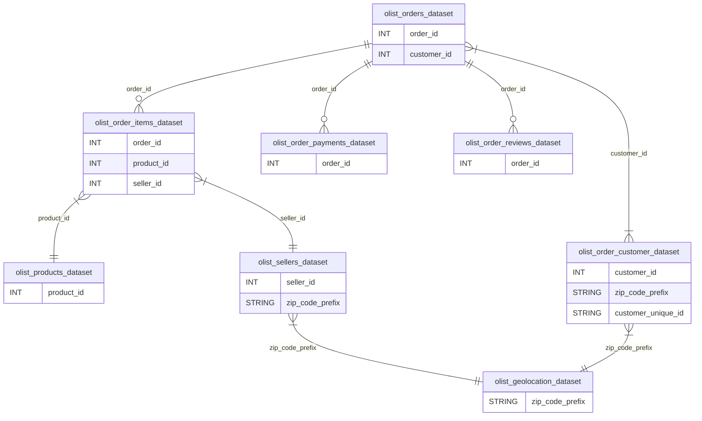

[Início](../README.md)

# Brazilian E-Commerce Public Dataset

## Visão Geral

Este dataset, disponibilizado pelo Olist no Kaggle, contém informações detalhadas sobre o comércio eletrônico no Brasil. Ele é composto por várias tabelas que registram diferentes aspectos das vendas online, desde dados de pedidos até informações de clientes, produtos, pagamentos e muito mais.

O conjunto de dados é uma ferramenta poderosa para análises de negócios, previsão de vendas, comportamento do consumidor e muitas outras aplicações em ciência de dados.

## Estrutura do Dataset

O dataset é composto por várias tabelas inter-relacionadas, conforme ilustrado no diagrama abaixo:

### Descrição das Tabelas Principais

- **olist_orders_dataset**: Contém os pedidos feitos na plataforma. Cada pedido é identificado por um `order_id`.
- **olist_order_items_dataset**: Detalhes dos itens que compõem cada pedido, incluindo o `product_id` e o `seller_id` (vendedor).
- **olist_products_dataset**: Informações sobre os produtos disponíveis na plataforma. Útil para entender quais produtos foram vendidos em cada pedido.
- **olist_sellers_dataset**: Contém dados dos vendedores, incluindo localização e identificação (`seller_id`).
- **olist_order_payments_dataset**: Informações sobre os pagamentos de cada pedido, como método de pagamento e parcelas.
- **olist_order_reviews_dataset**: Avaliações feitas pelos clientes para os pedidos, associadas pelo `order_id`.
- **olist_order_customer_dataset**: Tabela com informações dos clientes, como o `customer_id` e a localização de entrega (`zip_code_prefix`).
- **olist_geolocation_dataset**: Dados de geolocalização que permitem mapear os locais de entrega e vendedores utilizando o `zip_code_prefix`.

## Detalhes Específicos do Customers Dataset

A tabela **olist_order_customer_dataset** fornece informações sobre os clientes e suas localizações. É importante destacar que cada pedido é atribuído a um `customer_id` único, o que significa que o mesmo cliente pode ter diferentes `customer_id` para diferentes pedidos. No entanto, o campo `customer_unique_id` foi incluído para permitir a identificação de clientes que realizaram várias compras na loja.

Essa tabela pode ser usada para:

- **Identificar Compradores Frequentes**: Através do `customer_unique_id`, você pode identificar clientes que realizaram várias compras.
- **Análise Geográfica**: Usando o `zip_code_prefix`, você pode associar clientes a suas localizações e realizar análises geográficas.

---

## Detalhes Específicos do Geolocation Dataset

A tabela **olist_geolocation_dataset** fornece informações sobre os CEPs (Códigos de Endereçamento Postal) brasileiros, juntamente com suas coordenadas geográficas (latitude e longitude). Este dataset é essencial para qualquer análise que envolva localização geográfica.

Essa tabela pode ser usada para:

- **Análise de Distância**: Calcular distâncias entre clientes e vendedores, permitindo a análise do impacto da proximidade geográfica no tempo de entrega e satisfação do cliente.
- **Visualização Geoespacial**: Plotar mapas para visualizar a distribuição de clientes, vendedores ou pedidos em diferentes regiões do Brasil.

---

## Detalhes Específicos do Order Items Dataset

A tabela **olist_order_items_dataset** contém informações detalhadas sobre os itens incluídos em cada pedido realizado na Olist. Cada linha da tabela representa um item dentro de um pedido específico.

Essa tabela pode ser usada para:

- **Cálculo de Valores de Pedidos**: Determinar o valor total de cada pedido somando os preços dos produtos e os valores de frete.
- **Análise de Produtos Vendidos**: Identificar quais produtos são mais populares e como diferentes itens impactam o valor total do pedido.

---

## Detalhes Específicos do Payments Dataset

A tabela **olist_order_payments_dataset** contém informações sobre os métodos de pagamento utilizados pelos clientes para cada pedido. Inclui detalhes sobre o tipo de pagamento, a quantidade de parcelas, e o valor total pago.

Essa tabela pode ser usada para:

- **Análise de Preferências de Pagamento**: Identificar quais métodos de pagamento são mais populares entre os clientes e analisar como as preferências variam de acordo com o perfil do cliente ou o valor do pedido.
- **Análise de Parcelamento**: Avaliar a distribuição das vendas parceladas e identificar padrões relacionados ao uso de parcelamento como meio de pagamento.

---

## Detalhes Específicos do Order Reviews Dataset

A tabela **olist_order_reviews_dataset** contém informações sobre as avaliações feitas pelos clientes após receberem seus pedidos. Cada linha representa uma avaliação e inclui a nota dada pelo cliente, comentários e a data da avaliação.

Essa tabela pode ser usada para:

- **Análise de Satisfação do Cliente**: Avaliar o nível de satisfação dos clientes com base nas notas e comentários deixados. Isso pode ajudar a identificar áreas que precisam de melhorias.
- **Correlação com Tempo de Entrega**: Analisar como o tempo de entrega e outros fatores (como o tipo de produto ou a localização do vendedor) influenciam as avaliações dos clientes.

---

## Detalhes Específicos do Orders Dataset

A tabela **olist_orders_dataset** é o núcleo do dataset, contendo informações básicas sobre cada pedido realizado na Olist, como a data da compra, o status do pedido, e o ID do cliente associado.

Essa tabela pode ser usada para:

- **Análise do Ciclo de Vida do Pedido**: Monitorar o tempo que cada pedido leva para passar por diferentes estágios, desde a compra até a entrega.
- **Integração com Outros Datasets**: Utilizar o `order_id` para conectar esta tabela com outras (como itens, pagamentos e avaliações) e realizar análises mais complexas.

---

## Detalhes Específicos do Products Dataset

A tabela **olist_products_dataset** inclui informações sobre os produtos vendidos na Olist, como categoria, nome, e características físicas (como peso e dimensões).

Essa tabela pode ser usada para:

- **Análise de Categorias de Produtos**: Examinar o desempenho de diferentes categorias de produtos em termos de vendas e satisfação do cliente.
- **Cálculo de Custos de Frete**: Usar as dimensões e peso dos produtos para calcular ou verificar os custos de frete associados.

---

## Detalhes Específicos do Sellers Dataset

A tabela **olist_sellers_dataset** contém informações sobre os vendedores que realizam vendas na plataforma da Olist, incluindo dados de localização e identificação dos produtos vendidos.

Essa tabela pode ser usada para:

- **Análise de Desempenho de Vendedores**: Avaliar o desempenho dos vendedores com base no número de produtos vendidos, localização, e avaliações recebidas.
- **Análise Geográfica de Vendedores**: Relacionar a localização dos vendedores com o desempenho nas vendas e tempos de entrega.

---

## Detalhes Específicos do Category Name Translation

A tabela **product_category_name_translation** fornece a tradução dos nomes das categorias de produtos do português para o inglês, facilitando a interpretação e análise dos dados por um público internacional.

Essa tabela pode ser usada para:

- **Tradução e Padronização**: Traduzir e padronizar as categorias de produtos para facilitar a análise e a criação de relatórios em diferentes idiomas.

---

## Aplicações e Casos de Uso

Este dataset é ideal para uma variedade de análises, como:

- **Análise de Comportamento do Consumidor**: Identifique padrões de compras e clientes frequentes.
- **Previsão de Vendas**: Utilize os dados de pedidos e produtos para prever tendências futuras.
- **Análise de Desempenho de Vendedores**: Avalie o desempenho dos vendedores e a distribuição geográfica das vendas.
- **Estudos de Satisfação do Cliente**: Com base nos dados de avaliações, explore insights sobre a satisfação do cliente.

## Conclusão

O **Brazilian E-Commerce Public Dataset** oferece uma visão abrangente do mercado de e-commerce no Brasil. Com sua estrutura detalhada e inter-relacionada, ele é uma ferramenta poderosa para quem deseja realizar análises complexas e obter insights valiosos sobre o mercado e o comportamento do consumidor.
