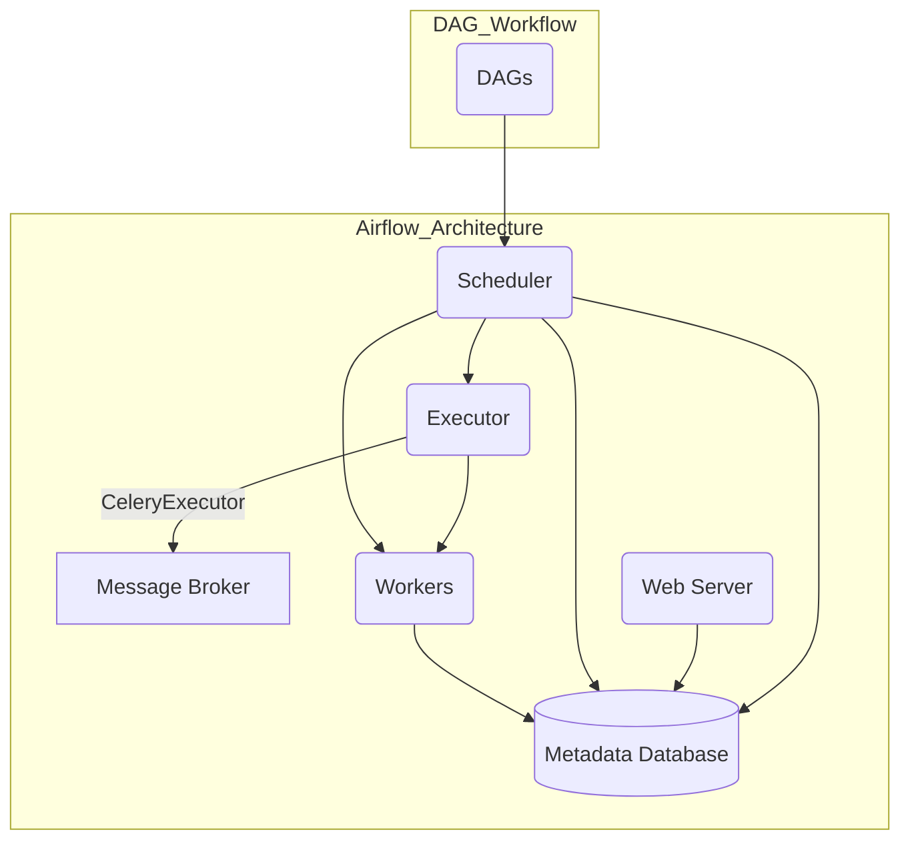

[Voltar ao módulo 3](../Módulo%203%20Apache%20Airflow%20+%20Hive.md)

# Conceitos Centrais

Agora que você está familiarizado com a introdução e os objetivos do Apache Airflow, vamos mergulhar nos conceitos centrais que sustentam essa poderosa ferramenta. Entender esses conceitos é crucial para criar, gerenciar e monitorar workflows complexos de forma eficaz.

### 1. **DAG (Directed Acyclic Graph)**

- **Definição**: Uma DAG é uma coleção de tarefas organizadas em uma forma gráfica. No Airflow, uma DAG representa um pipeline de tarefas que são organizadas e executadas em uma ordem específica.
- **Características**:
  - **Direcionado**: As tarefas têm uma direção específica de execução, de uma para a outra.
  - **Acíclico**: Não há ciclos ou loops nas dependências, ou seja, uma tarefa não pode depender de si mesma, diretamente ou indiretamente.
- **Uso**: No Airflow, você define uma DAG usando código Python, especificando as tarefas e suas dependências.

### 2. **Task**

- **Definição**: Uma Task é a unidade de trabalho executável em uma DAG. Cada tarefa dentro de uma DAG representa uma ação ou operação específica que precisa ser realizada.
- **Tipos de Tasks**:
  - **Operators**: São as unidades de trabalho pré-definidas no Airflow que representam tarefas. Alguns exemplos incluem:
    - `PythonOperator` para executar funções Python.
    - `BashOperator` para executar comandos Bash.
    - `HttpOperator` para fazer solicitações HTTP.
  - **Sensors**: São tarefas especiais que aguardam uma condição ser atendida antes de continuar a execução.
- **Execução**: As tarefas podem ser executadas em paralelo ou em sequência, dependendo de suas dependências dentro da DAG.

### 3. **Operator**

- **Definição**: Um Operator é um objeto que encapsula o código a ser executado por uma tarefa. Ele define o que a tarefa fará, por exemplo, rodar um script Python, fazer uma solicitação HTTP, transferir dados, etc.
- **Tipos Comuns**:
  - **PythonOperator**: Executa funções Python.
  - **BashOperator**: Executa comandos Bash.
  - **DummyOperator**: Não executa nenhuma ação, usado para marcar pontos na DAG.
  - **Sensors**: Um tipo especial de operador que espera por uma condição antes de prosseguir, como a chegada de um arquivo ou a conclusão de um processo.

### 4. **Task Instance**

- **Definição**: Uma Task Instance é uma instância de uma tarefa em um determinado momento de execução. Ela é específica para uma DAG em uma determinada execução.
- **Status da Task Instance**:
  - **success**: A tarefa foi concluída com sucesso.
  - **failed**: A tarefa falhou.
  - **running**: A tarefa está em execução.
  - **skipped**: A tarefa foi pulada.
- **Uso**: Task Instances são usadas para monitorar e gerenciar o estado de cada tarefa durante a execução de uma DAG.

### 5. **Executor**

- **Definição**: O Executor é responsável por como as tarefas são executadas. Ele gerencia a execução das tasks, distribuindo-as em diferentes workers ou processos.
- **Tipos de Executors**:
  - **SequentialExecutor**: Executa tarefas uma de cada vez.
  - **LocalExecutor**: Executa tarefas em paralelo em processos diferentes, mas no mesmo nó.
  - **CeleryExecutor**: Distribui tarefas para múltiplos workers em um cluster.
  - **KubernetesExecutor**: Executa cada tarefa em um pod do Kubernetes.

### 6. **Scheduler**

- **Definição**: O Scheduler é o componente do Airflow que determina quando cada tarefa deve ser executada, com base no cronograma da DAG.
- **Função**: Ele monitora as DAGs e suas tarefas, enfileira as tarefas para execução quando as dependências forem atendidas e distribui as tarefas para o executor.

### 7. **Web UI**

- **Definição**: A Web UI do Airflow é a interface gráfica onde você pode monitorar, gerenciar e visualizar suas DAGs e tarefas.
- **Características**:
  - **Visualização de DAGs**: Veja a estrutura da DAG e o status das tarefas em tempo real.
  - **Logs**: Acesse os logs de execução para depurar tarefas.
  - **Triggers**: Inicie, pause ou agende execuções de DAGs.

### 8. **Connections & Hooks**

- **Connections**: São definições centralizadas de conexões a sistemas externos, como bancos de dados, APIs ou outras fontes de dados.
- **Hooks**: São interfaces de código que utilizam as Connections para se comunicar com sistemas externos. Por exemplo, `PostgresHook`, `MySqlHook`, `HttpHook`, etc.

### 9. **XComs (Cross-communication)**

- **Definição**: XComs são uma forma de comunicação entre tarefas dentro de uma DAG. Permitem que as tarefas compartilhem pequenos pedaços de informação, como strings ou objetos Python.
- **Uso**: Uma tarefa pode “push” (enviar) um valor para XCom, e outra tarefa pode “pull” (receber) esse valor para uso posterior.

### 10. **Variables**

- **Definição**: Variáveis são valores globais que podem ser utilizados em qualquer DAG ou tarefa no Airflow. Elas podem ser configuradas diretamente na Web UI ou via código.
- **Uso**: Muito útil para armazenar configurações, credenciais, ou outros valores que precisam ser reutilizados em várias DAGs.

### Próximo Documento

- [Ciclo de Vida da Task](Ciclo%20de%20Vida%20da%20Task.md)
