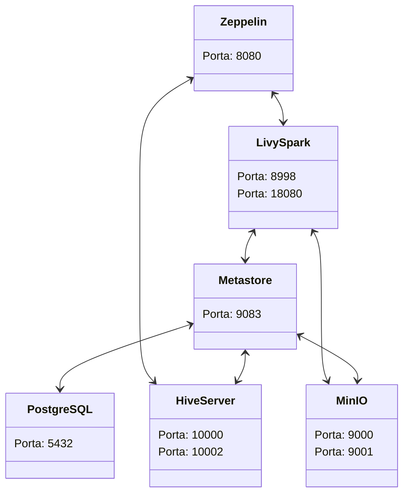

# Engenheiro de Dados - Assistente

# Introdução

---

# Big Data Sandbox

Este projeto tem como objetivo fornecer um ambiente de sandbox para testes de big data. Consiste em um ambiente Docker com vários contêineres contendo:

## Neste diagrama:

- **Zeppelin (Zeppelin)**: O Zeppelin é uma ferramenta de notebook interativo para análise de dados, semelhante ao Jupyter Notebook. Suporta várias linguagens de programação, como Scala, Python, SQL e R, permitindo a criação de gráficos, tabelas e visualizações interativas diretamente no notebook.
- **Livy-Spark (Livy-Spark)**: Livy é um servidor para interação com clusters Apache Spark remotamente. Permite que os usuários enviem tarefas Spark (como processamento de dados em larga escala) através de uma API REST, facilitando a execução de trabalhos Spark em ambientes distribuídos.
- **Metastore (Metastore)**: O Metastore faz parte do ecossistema Apache Hive, sendo utilizado para armazenar metadados de tabelas Hive. Gerencia informações como esquemas de tabelas, localizações de dados e outras propriedades importantes para consultas e operações do Hive.
- **HiveServer (HiveServer)**: O HiveServer é um servidor que fornece interfaces JDBC e Thrift para consultas SQL em um cluster Hive. Permite que aplicativos externos, como ferramentas de Business Intelligence e outros programas, se conectem ao Hive e executem consultas SQL para análise de dados armazenados no Hadoop.
- **PostgreSQL (PostgreSQL)**: PostgreSQL é um sistema de gerenciamento de banco de dados relacional (RDBMS) de código aberto. É conhecido por sua confiabilidade, recursos avançados de SQL, suporte a transações ACID e extensibilidade, amplamente utilizado em aplicações que requerem um banco de dados robusto e escalável.
- **MinIO (MinIO)**: MinIO é um servidor de armazenamento de objetos de código aberto compatível com o Amazon S3 (Simple Storage Service). É projetado para ser escalável, de alto desempenho e adequado para cargas de trabalho de armazenamento em nuvem, permitindo o armazenamento e a recuperação eficiente de grandes volumes de dados não estruturados.

Esses contêineres estão configurados para se comunicarem entre si, permitindo a realização de tarefas de processamento de big data.

## Requisitos

Antes de instalar e executar este projeto, certifique-se de que seu sistema atende aos seguintes requisitos:

- Docker instalado e configurado corretamente.
- Espaço suficiente em disco para contêineres e dados gerados.
- Conexão com a Internet para baixar imagens Docker e dependências durante a configuração inicial.

## Primeiro acesso

Se este é o seu primeiro acesso à trilha, abaixo está a preparação do ambiente necessária.

[Preparação do ambiente](Knowledge-Trail%20-%20Assistent/Preparação%20do%20ambiente.md)

## Links das portas

Acesse os serviços nos seguintes links:

- Zeppelin:
  - [8080](http://localhost:8080/): interface do usuário
- Livy-Spark:
  - [18080](http://localhost:18080/): interface do usuário do History Server
  - [8998](http://localhost:8998/): interface do usuário do Livy Server
- MinIO:
  - 9000: MinIO
  - [9001](http://localhost:9001/): interface do usuário
- Metastore:
  - 9083: Metastore
- HiveServer:
  - [10002](http://localhost:10002/): interface do usuário
  - 10000: HiveServer
- PostgreSQL:
  - 5432: PostgreSQL

## Módulos

[Brazilian E-Commerce Public Dataset](Knowledge-Trail%20-%20Assistent/Brazilian%20E-Commerce%20Public%20Dataset.md)

[Módulo 1: MinIO](Knowledge-Trail%20-%20Assistent/Módulo%201%20MinIO.md)

[Módulo 2: Apache Zeppelin + Livy Spark + History Server](Knowledge-Trail%20-%20Assistent/Módulo%202%20Apache%20Zeppelin%20+%20Livy%20Spark%20+%20History%20S.md)

[Módulo 3: Apache Airflow + Hive](Knowledge-Trail%20-%20Assistent/Módulo%203%20Apache%20Airflow%20+%20Hive.md)
